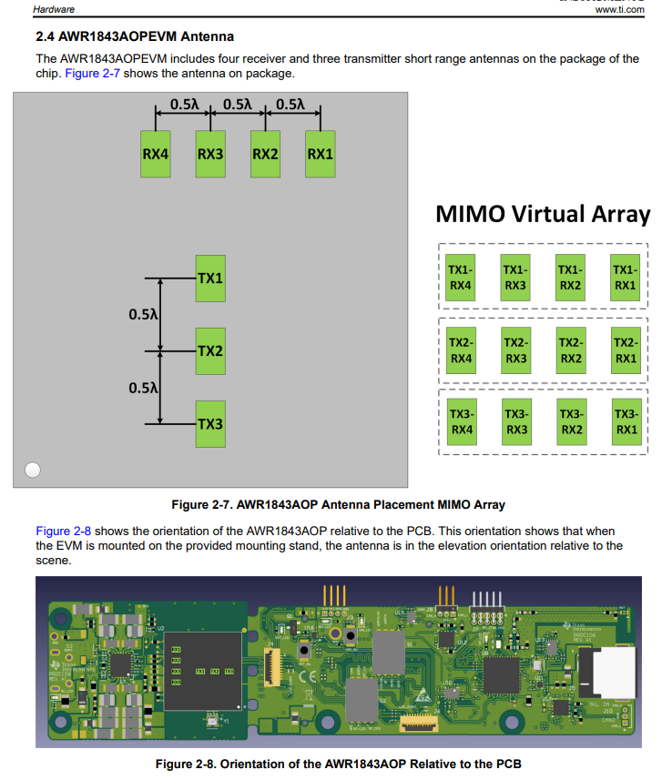

# xwr_raw_ros

**ROS node for real-time raw ADC I/Q sample data capture and processing from TI AWR/IWR radar EVMs + DCA1000EVM combo.** 
Developed and used in the following papers:

> **[BatMobility: Towards Flying Without Seeing for Autonomous Drones](https://dl.acm.org/doi/10.1145/3570361.3592532)**  
> Emerson Sie, Zikun Liu, Deepak Vasisht    
> *ACM International Conference on Mobile Computing and Networking (**MobiCom**), 2023* 

> **[Radarize: Large-Scale Radar SLAM for Indoor Environments](https://arxiv.org/abs/2311.11260)**  
> Emerson Sie, Xinyu Wu, Heyu Guo, Deepak Vasisht
>

https://github.com/ConnectedSystemsLab/xwr_raw_ros/assets/14133352/1cef32bf-e6d5-48c4-a3ba-73317eed2fce

## Features
- Tested on **ROS Melodic/Noetic**, **Ubuntu 18.04/20.04**.
- Tested on **xWR1843, xWR6843ISK, xWR6843ISK-ODS, xWR2944, xWR1843AOP, xWR6843AOP**

## Organization
- `configs/` - Sample radar configs.
- `nodes/`
    - `radar.py` - Starts radar EVM and publishes data from DCA1000 EVM.
    - `visra.py` - Subscribes to radar samples to visualize range-azimuth heatmaps.
    - `visda.py` - Subscribes to radar samples to visualize doppler-angle heatmaps.
- `src/`
    - `xwr_raw/` - Python package containing code for nodes.
        - `radar_pub.py` - Handles all communication with EVMs.
        - `dsp.py` - Low level signal processing functions (beamforming, etc.)
    - `recver.cpp` - Implementation of raw data receiver in C.
- `launch/` 
    - `radar.launch` - Run raw sample node.
    - `radar_pcd.launch` - Visualize point cloud + get raw samples at same time.
    - `radar_visra.launch` - Visualize range-azimuth heatmaps from raw samples in real-time.
    - `radar_visda.launch` - Visualize doppler-azimuth heatmaps from raw samples in real-time.
    - `radar_visra_c.launch` - Same as above, but with optimized C receiver.
- `udev/` - udev rules for USB ports.
 
## Getting Started

1. Install ROS [Noetic](http://wiki.ros.org/noetic/Installation/Ubuntu) or [Melodic](https://wiki.ros.org/melodic/Installation/Ubuntu).
2. Create catkin workspace.
```bash 
mkdir -p ~/catkin_ws/src
```
3. Clone repository.
```bash
cd ~/catkin_ws/src && git clone https://github.com/ConnectedSystemsLab/xwr_raw_ros.git
```
4. Install ROS and Python dependencies.
```bash
cd ..
rosdep install --from-paths src --ignore-src -iry && pip install -r src/xwr_raw_ros/requirements.txt
```
5. Build node.
```bash 
cd ~/catkin_ws && catkin build
```
6. Source overlay.
```bash
source devel/setup.bash
```
7. Copy udev rule files under `udev` to `/etc/udev/rules.d` and run 
```bash
sudo udevadm control --reload-rules
sudo usermod -a -G dialout $USER
```
Make sure to logout and log back in so usermod takes effect.

8. Connect radar + DCA1000EVM to the host (see [Hardware Setup](#Hardware-Setup)). Set host + DCA1000EVM IPs and ports accordingly.
  
9. Edit and launch a ```.launch``` file i.e. 
```bash 
roslaunch xwr_raw_ros radar_visra.launch
```
Make sure the parameters (e.g. IP addresses and ports, serial ports, radar config) in the ```.launch``` file are correct. You should see an output similar to example.mp4.

## Hardware Setup 

### xWR1843
Connect the wires + set pins and switches on the board as follows.


- Config port: `/dev/tty1843_00`
- Data port: `/dev/tty1843_03`

#### Notes

- [User Guide](https://www.ti.com/lit/ug/spruim4b/spruim4b.pdf)

1. Make sure SOP switches set to functional mode on EVM.
2. Power the DCA1000EVM through the EVM by pass-through.

### xWR6843ISK


- Config port: `/dev/ttyISK_00`
- Data port: `/dev/ttyISK_01`

#### Notes

- [User Guide](https://www.ti.com/lit/ug/swru546e/swru546e.pdf)

1. Make sure SOP switches set to functional mode on EVM.
2. Power the DCA1000EVM using barrel connector directly.

### xWR6843ISK-ODS


- Config port: `/dev/ttyISK_00`
- Data port: `/dev/ttyISK_01`

#### Notes

- [User Guide](https://www.ti.com/lit/ug/swru546e/swru546e.pdf)

1. Make sure SOP switches set to functional mode on EVM.
2. Power the DCA1000EVM using barrel connector directly.

### xWR2944

Connect the wires + set pins and switches on the board as follows.


#### Notes

- [User Guide](https://www.ti.com/lit/ug/spruj22a/spruj22a.pdf)

1. You need a 12V 2.5A barrel connector to power the radar AND a normal 5V barrel connector to power the DCA1000EVM.
2. Ensure SOP1 jumper is removed before powering the radar EVM.
3. You must first power the radar EVM and make sure the XDS ports show as connected, and only then turn on the DCA1000EVM.
    - Best way to do this is to only flip on the DCA1000EVM power switch after powering the radar.

### xWR1843AOP

Connect the wires + set pins and switches on the board as follows.



- Config port: `/dev/ttyISK_00`
- Data port: `/dev/ttyISK_01`

#### Notes

- [User Guide](https://www.ti.com/lit/ug/spruix8/spruix8.pdf)

### xWR6843AOP

Connect the wires + set pins and switches on the board as follows.


- Config port: `/dev/ttyISK_00`
- Data port: `/dev/ttyISK_01`

#### Notes

- [User Guide](https://www.ti.com/lit/ug/swru546e/swru546e.pdf)

<!---
# DCA1000

## Setup Instructions
- [Quick Start Guide](docs/DCA1000EVM_Quick_Start.pdf)
- [User Guide](docs/DCA1000EVM_User_Guide.pdf)

## Theory 
- [Intro to FMCW](docs/Introduction_to_mmwave_Sensing_FMCW_Radars.pdf)
- [MIMO Radar](docs/MIMO_Radar.pdf)

## Useful Tools
- [Uniflash Tool](https://dev.ti.com/uniflash/#!/)
- [mmWave Demo Visualizer](https://dev.ti.com/gallery/view/mmwave/mmWave_Demo_Visualizer/)

## mmWave SDK
- [mmWave Demo User Guide](docs/MMWAVE_Demo_Visualizer_User_Guide.pdf)
- [mmWave SDK User Guide v3](docs/MMWAVE_SDK_User_Guide_v3.pdf)
- [Programming Chirp Parameters](docs/Programming_Chirp_Parameters_A.pdf)

## CLI Documentation
- [CLI Software User Guide](docs/DCA1000EVM_CLI_Software_UserGuide.pdf)
- [CLI Software Dev Guide](docs/DCA1000EVM_CLI_Software_DeveloperGuide.pdf)

## Data Capture Format
- [mmWave Radar ADC Raw Data Capture](docs/MMWAVE_Radar_Device_ADC_Raw_Data_Capture.pdf)
- [AWR1xxx AWR22xxx Data Path](docs/AWR1xxx_AWR22xx_Data_Path.pdf)
- [Migrating to xWR68xx and xWR18xx Sensors](docs/Migrating_to_xWR68xx_and_xWR18xx_Millimeter_Wave_Sensors.pdf)
- [Raw Data Capture for XWR6843 Device Using DCA1000 Board and mmWave Studio](docs/mmWave_sensor_raw_data_capture_using_DCA1000_xwr6843.pdf)
- [mmWave Sensor Raw Data Capture Using the DCA1000 Board and mmWave Studio](docs/mmwave_sensor_raw_data_capture_using_dca1000_v02.pdf)
--->

## Citation 

If you found this repository useful, please cite the following:

```bibtex
@inproceedings{sie2023batmobility,
  author    = {Sie, Emerson and Liu, Zikun and Vasisht, Deepak},
  title     = {BatMobility: Towards Flying Without Seeing for Autonomous Drones},
  booktitle = {ACM International Conference on Mobile Computing (MobiCom)},
  year      = {2023},
  doi       = {https://doi.org/10.1145/3570361.3592532},
}
```

```bibtex
@misc{sie2023radarize,
  title      = {Radarize: {Large}-{Scale} {Radar} {SLAM} for {Indoor} {Environments}},
  url        = {http://arxiv.org/abs/2311.11260},
  publisher  = {arXiv},
  author     = {Sie, Emerson and Wu, Xinyu and Guo, Heyu and Vasisht, Deepak},
  year       = {2023},
  doi        = {https://doi.org/10.48550/arXiv.2311.11260},
}
```
